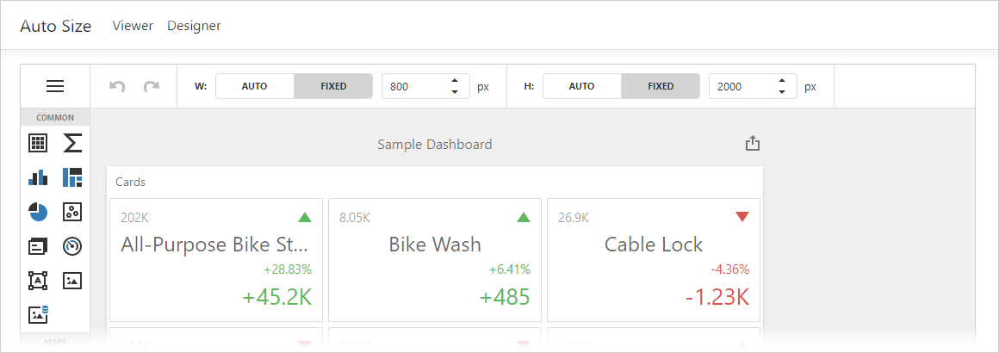

<!-- default badges list -->

<!-- default badges end -->
# Dashboard for ASP.NET Core - How to Calculate Layout Size based on 

This example shows how to set the control in Viewer mode to the same size as the dashboard. This method allows you to avoid two scroll bars on the page. 

You can open the control in Designer mode to resize the dashboard. Instead of Viewer mode, the control in Designer mode occupies the HTML page's visible area.

When you change the size in Designer mode, switch the control to Viewer mode. The size of the control will become equal to the size of the dashboard.

<!-- default file list -->
## Files to Look At

- [Index.cshtml](./CS/AspNetCoreDashboardControlAutoSize/Index.cshtml)
- [Designer.cshtml](./CS/AspNetCoreDashboardControlAutoSize/Designer.cshtml)
<!-- default file list end --> 

## Documentation

- [LayoutOptions](https://docs.devexpress.com/Dashboard/js-DevExpress.Dashboard.Model.LayoutOptions)
